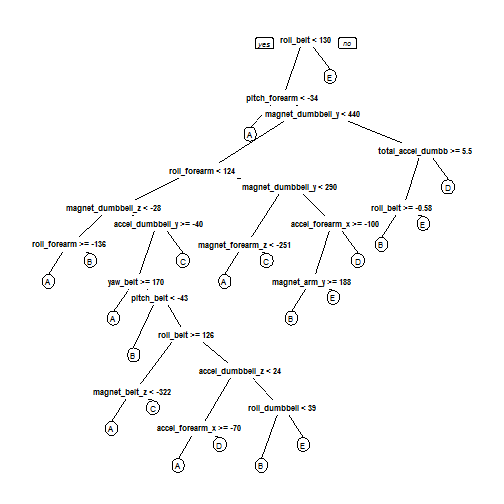

## Introduction  

Using devices such as Jawbone Up, Nike FuelBand, and Fitbit has made possible to collect large amount of data about personal activity without incurring much cost. These type of devices are part of the quantified self movement - a group of enthusiasts who take measurements about themselves regularly to improve their health, to find patterns in their behavior, or because they are tech geeks. The purpose of this exercise is how well an activity was an activity was performed by the individual. "how (well)" investigation has only received little attention so far, even though it potentially provides useful information for a large variety of applications,such as sports training.

Read more: http://groupware.les.inf.puc-rio.br/har#ixzz3dj0VFTzd

Class Specifications:
Class A : Dumbbell Biceps Curl in five different fashions
Class B : throwing the elbows to the front
Class C : lifting the dumbbell only halfway
Class D : lowering the dumbbell only halfway
Class E : throwing the hips to the front 


In this project, the dataset is collected from accelerometers on the belt, forearm, arm, and dumbell of 6 participants to predict the manner in which they did the exercise.  


## Data Preparation  

```r
library(randomForest)
```

```
## randomForest 4.6-10
## Type rfNews() to see new features/changes/bug fixes.
```

```r
library(corrplot)
library(caret)
```

```
## Loading required package: lattice
## Loading required package: ggplot2
```

```r
library(rpart)
library(rpart.plot)
```
### Download the Data

```r
trainUrl <-"https://d396qusza40orc.cloudfront.net/predmachlearn/pml-training.csv"
testUrl <- "https://d396qusza40orc.cloudfront.net/predmachlearn/pml-testing.csv"
trainFilePath <- "./data/pml-training.csv"
testFilePath  <- "./data/pml-testing.csv"
if (!file.exists("./data")) {
  dir.create("./data")
}
if (!file.exists(trainFilePath)) {
  download.file(trainUrl, destfile=trainFilePath, method="curl")
}
if (!file.exists(testFilePath)) {
  download.file(testUrl, destfile=testFilePath, method="curl")
}
```

### Read the Data
After downloading the data from the source location, we can read the content of csv files into two data frames.  

```r
trainRaw <- read.csv("./data/pml-training.csv")
testRaw <- read.csv("./data/pml-testing.csv")
dim(trainRaw)
```

```
## [1] 19622   160
```

```r
dim(testRaw)
```

```
## [1]  20 160
```

The training data set contains 19622 observations and 160 variables, while the testing data set contains 20 observations and 160 variables. The "classe" variable in the training set is the outcome to predict. 

The names of all the variables, "classe" being the 160th variable.

```r
names(trainRaw)
```

```
##   [1] "X"                        "user_name"               
##   [3] "raw_timestamp_part_1"     "raw_timestamp_part_2"    
##   [5] "cvtd_timestamp"           "new_window"              
##   [7] "num_window"               "roll_belt"               
##   [9] "pitch_belt"               "yaw_belt"                
##  [11] "total_accel_belt"         "kurtosis_roll_belt"      
##  [13] "kurtosis_picth_belt"      "kurtosis_yaw_belt"       
##  [15] "skewness_roll_belt"       "skewness_roll_belt.1"    
##  [17] "skewness_yaw_belt"        "max_roll_belt"           
##  [19] "max_picth_belt"           "max_yaw_belt"            
##  [21] "min_roll_belt"            "min_pitch_belt"          
##  [23] "min_yaw_belt"             "amplitude_roll_belt"     
##  [25] "amplitude_pitch_belt"     "amplitude_yaw_belt"      
##  [27] "var_total_accel_belt"     "avg_roll_belt"           
##  [29] "stddev_roll_belt"         "var_roll_belt"           
##  [31] "avg_pitch_belt"           "stddev_pitch_belt"       
##  [33] "var_pitch_belt"           "avg_yaw_belt"            
##  [35] "stddev_yaw_belt"          "var_yaw_belt"            
##  [37] "gyros_belt_x"             "gyros_belt_y"            
##  [39] "gyros_belt_z"             "accel_belt_x"            
##  [41] "accel_belt_y"             "accel_belt_z"            
##  [43] "magnet_belt_x"            "magnet_belt_y"           
##  [45] "magnet_belt_z"            "roll_arm"                
##  [47] "pitch_arm"                "yaw_arm"                 
##  [49] "total_accel_arm"          "var_accel_arm"           
##  [51] "avg_roll_arm"             "stddev_roll_arm"         
##  [53] "var_roll_arm"             "avg_pitch_arm"           
##  [55] "stddev_pitch_arm"         "var_pitch_arm"           
##  [57] "avg_yaw_arm"              "stddev_yaw_arm"          
##  [59] "var_yaw_arm"              "gyros_arm_x"             
##  [61] "gyros_arm_y"              "gyros_arm_z"             
##  [63] "accel_arm_x"              "accel_arm_y"             
##  [65] "accel_arm_z"              "magnet_arm_x"            
##  [67] "magnet_arm_y"             "magnet_arm_z"            
##  [69] "kurtosis_roll_arm"        "kurtosis_picth_arm"      
##  [71] "kurtosis_yaw_arm"         "skewness_roll_arm"       
##  [73] "skewness_pitch_arm"       "skewness_yaw_arm"        
##  [75] "max_roll_arm"             "max_picth_arm"           
##  [77] "max_yaw_arm"              "min_roll_arm"            
##  [79] "min_pitch_arm"            "min_yaw_arm"             
##  [81] "amplitude_roll_arm"       "amplitude_pitch_arm"     
##  [83] "amplitude_yaw_arm"        "roll_dumbbell"           
##  [85] "pitch_dumbbell"           "yaw_dumbbell"            
##  [87] "kurtosis_roll_dumbbell"   "kurtosis_picth_dumbbell" 
##  [89] "kurtosis_yaw_dumbbell"    "skewness_roll_dumbbell"  
##  [91] "skewness_pitch_dumbbell"  "skewness_yaw_dumbbell"   
##  [93] "max_roll_dumbbell"        "max_picth_dumbbell"      
##  [95] "max_yaw_dumbbell"         "min_roll_dumbbell"       
##  [97] "min_pitch_dumbbell"       "min_yaw_dumbbell"        
##  [99] "amplitude_roll_dumbbell"  "amplitude_pitch_dumbbell"
## [101] "amplitude_yaw_dumbbell"   "total_accel_dumbbell"    
## [103] "var_accel_dumbbell"       "avg_roll_dumbbell"       
## [105] "stddev_roll_dumbbell"     "var_roll_dumbbell"       
## [107] "avg_pitch_dumbbell"       "stddev_pitch_dumbbell"   
## [109] "var_pitch_dumbbell"       "avg_yaw_dumbbell"        
## [111] "stddev_yaw_dumbbell"      "var_yaw_dumbbell"        
## [113] "gyros_dumbbell_x"         "gyros_dumbbell_y"        
## [115] "gyros_dumbbell_z"         "accel_dumbbell_x"        
## [117] "accel_dumbbell_y"         "accel_dumbbell_z"        
## [119] "magnet_dumbbell_x"        "magnet_dumbbell_y"       
## [121] "magnet_dumbbell_z"        "roll_forearm"            
## [123] "pitch_forearm"            "yaw_forearm"             
## [125] "kurtosis_roll_forearm"    "kurtosis_picth_forearm"  
## [127] "kurtosis_yaw_forearm"     "skewness_roll_forearm"   
## [129] "skewness_pitch_forearm"   "skewness_yaw_forearm"    
## [131] "max_roll_forearm"         "max_picth_forearm"       
## [133] "max_yaw_forearm"          "min_roll_forearm"        
## [135] "min_pitch_forearm"        "min_yaw_forearm"         
## [137] "amplitude_roll_forearm"   "amplitude_pitch_forearm" 
## [139] "amplitude_yaw_forearm"    "total_accel_forearm"     
## [141] "var_accel_forearm"        "avg_roll_forearm"        
## [143] "stddev_roll_forearm"      "var_roll_forearm"        
## [145] "avg_pitch_forearm"        "stddev_pitch_forearm"    
## [147] "var_pitch_forearm"        "avg_yaw_forearm"         
## [149] "stddev_yaw_forearm"       "var_yaw_forearm"         
## [151] "gyros_forearm_x"          "gyros_forearm_y"         
## [153] "gyros_forearm_z"          "accel_forearm_x"         
## [155] "accel_forearm_y"          "accel_forearm_z"         
## [157] "magnet_forearm_x"         "magnet_forearm_y"        
## [159] "magnet_forearm_z"         "classe"
```


### Clean the data
We will keep relevant variables and get rid of the rest.

First, we remove columns that contain NA missing values.

```r
trainRaw <- trainRaw[, colSums(is.na(trainRaw)) == 0] 
testRaw <- testRaw[, colSums(is.na(testRaw)) == 0] 
```

Next, we get rid of attributes which do not contribute much to the accelerometer measurements. Like '^timestamp' etc which is to purpose warehousing needs and not relevant for this analysis.


```r
final_class <- trainRaw$classe
trainFilter <- grepl("^X|timestamp|window|username", names(trainRaw))
train_OnlyImpFeatures <- trainRaw[, !trainFilter]
trainCleaned <- train_OnlyImpFeatures[, sapply(train_OnlyImpFeatures, is.numeric)]

trainCleaned$classe <- final_class

testFilter <- grepl("^X|timestamp|window|username", names(testRaw))
test_OnlyImpFeatures <- testRaw[, !testFilter]
testCleaned <- test_OnlyImpFeatures[, sapply(test_OnlyImpFeatures, is.numeric)]

names(trainCleaned)
```

```
##  [1] "roll_belt"            "pitch_belt"           "yaw_belt"            
##  [4] "total_accel_belt"     "gyros_belt_x"         "gyros_belt_y"        
##  [7] "gyros_belt_z"         "accel_belt_x"         "accel_belt_y"        
## [10] "accel_belt_z"         "magnet_belt_x"        "magnet_belt_y"       
## [13] "magnet_belt_z"        "roll_arm"             "pitch_arm"           
## [16] "yaw_arm"              "total_accel_arm"      "gyros_arm_x"         
## [19] "gyros_arm_y"          "gyros_arm_z"          "accel_arm_x"         
## [22] "accel_arm_y"          "accel_arm_z"          "magnet_arm_x"        
## [25] "magnet_arm_y"         "magnet_arm_z"         "roll_dumbbell"       
## [28] "pitch_dumbbell"       "yaw_dumbbell"         "total_accel_dumbbell"
## [31] "gyros_dumbbell_x"     "gyros_dumbbell_y"     "gyros_dumbbell_z"    
## [34] "accel_dumbbell_x"     "accel_dumbbell_y"     "accel_dumbbell_z"    
## [37] "magnet_dumbbell_x"    "magnet_dumbbell_y"    "magnet_dumbbell_z"   
## [40] "roll_forearm"         "pitch_forearm"        "yaw_forearm"         
## [43] "total_accel_forearm"  "gyros_forearm_x"      "gyros_forearm_y"     
## [46] "gyros_forearm_z"      "accel_forearm_x"      "accel_forearm_y"     
## [49] "accel_forearm_z"      "magnet_forearm_x"     "magnet_forearm_y"    
## [52] "magnet_forearm_z"     "classe"
```

The number of variables reduced from 160 to 53. Now, the cleaned training data set contains 19622 observations and 53 variables, while the testing data set contains 20 observations and 53 variables. The "classe" variable is still exist in the cleaned training set.

### Data Slicing
Then, we can split the cleaned training set into a pure training data set (70%) and a validation data set (30%). We will use the validation data set to conduct cross validation in future steps.


```r
set.seed(12345) 
inTrain <- createDataPartition(trainCleaned$classe, p=0.70, list=F)
trainData <- trainCleaned[inTrain, ]
testData <- trainCleaned[-inTrain, ]
```

## Fitting the model

We fit a predictive model for activity recognition using **Random Forest** algorithm because it automatically selects important variables and is robust to correlated covariates & outliers in general. We will set training control parameter to 5 for **5-fold cross validation** when applying the algorithm.  


```r
controlRf <- trainControl(method="cv", 5)
modelRf <- train(classe ~ ., data=trainData, method="rf", trControl=controlRf, ntree=250)
modelRf
```

```
## Random Forest 
## 
## 13737 samples
##    52 predictor
##     5 classes: 'A', 'B', 'C', 'D', 'E' 
## 
## No pre-processing
## Resampling: Cross-Validated (5 fold) 
## 
## Summary of sample sizes: 10989, 10990, 10990, 10989, 10990 
## 
## Resampling results across tuning parameters:
## 
##   mtry  Accuracy   Kappa      Accuracy SD  Kappa SD   
##    2    0.9913372  0.9890408  0.001042652  0.001319170
##   27    0.9903181  0.9877518  0.000983576  0.001244985
##   52    0.9857320  0.9819505  0.001190140  0.001505432
## 
## Accuracy was used to select the optimal model using  the largest value.
## The final value used for the model was mtry = 2.
```

## Performance Evaluation

Next, we estimate the performance of the model on the validation data set.  


```r
predictRf <- predict(modelRf, testData)
confusionMatrix(testData$classe, predictRf)
```

```
## Confusion Matrix and Statistics
## 
##           Reference
## Prediction    A    B    C    D    E
##          A 1673    1    0    0    0
##          B   13 1121    5    0    0
##          C    0   16 1007    3    0
##          D    0    0   24  940    0
##          E    0    0    0    3 1079
## 
## Overall Statistics
##                                           
##                Accuracy : 0.989           
##                  95% CI : (0.9859, 0.9915)
##     No Information Rate : 0.2865          
##     P-Value [Acc > NIR] : < 2.2e-16       
##                                           
##                   Kappa : 0.986           
##  Mcnemar's Test P-Value : NA              
## 
## Statistics by Class:
## 
##                      Class: A Class: B Class: C Class: D Class: E
## Sensitivity            0.9923   0.9851   0.9720   0.9937   1.0000
## Specificity            0.9998   0.9962   0.9961   0.9951   0.9994
## Pos Pred Value         0.9994   0.9842   0.9815   0.9751   0.9972
## Neg Pred Value         0.9969   0.9964   0.9940   0.9988   1.0000
## Prevalence             0.2865   0.1934   0.1760   0.1607   0.1833
## Detection Rate         0.2843   0.1905   0.1711   0.1597   0.1833
## Detection Prevalence   0.2845   0.1935   0.1743   0.1638   0.1839
## Balanced Accuracy      0.9960   0.9906   0.9840   0.9944   0.9997
```


```r
accuracy <- postResample(predictRf, testData$classe)
accuracy
```

```
##  Accuracy     Kappa 
## 0.9889550 0.9860251
```

```r
ooserr <- 1 - as.numeric(confusionMatrix(testData$classe, predictRf)$overall[1])
ooserr
```

```
## [1] 0.01104503
```

The accuracy is ***0.9889550 *** and kappa is ***0.9860251 ***.


## Predicting on the test Data Set
We now apply the model to the original testing data set downloaded from the data source. 


```r
result <- predict(modelRf, testCleaned[, -length(names(testCleaned))])
result
```

```
##  [1] B A B A A E D B A A B C B A E E A B B B
## Levels: A B C D E
```


## Appendix: Visulaization

1. Decision Tree Visualization


```r
treeModel <- rpart(classe ~ ., data=trainData, method="class")
prp(treeModel) 
```

 


